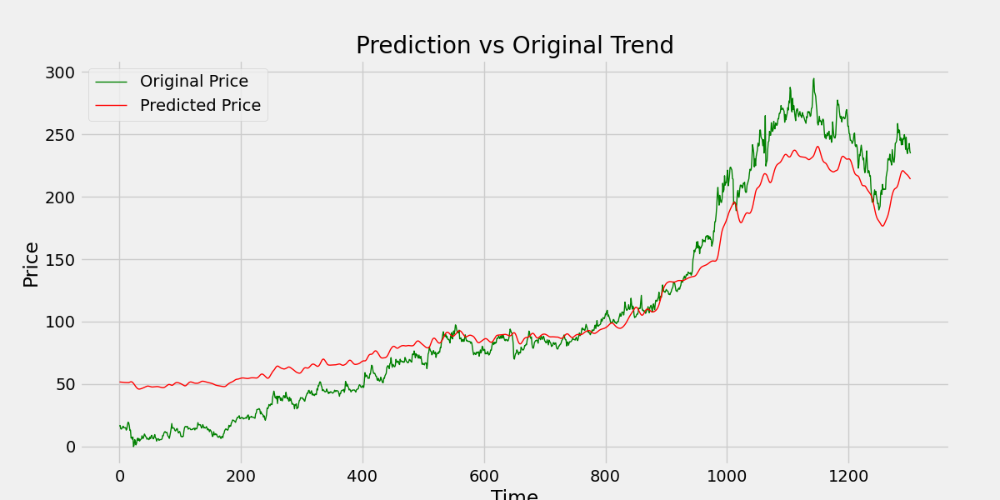

# 📈 Stock Trend Prediction 

This Flask-based application predicts stock prices using a deep learning model (LSTM).  
It processes **real-time stock data from January 2000 to May 2025** and visualizes trends using Exponential Moving Averages (EMAs).

---

## 🚀 Features

- 📉 Stock price prediction using an LSTM model
- 📊 Visualizations:
  - Closing price + EMA 20/50
  - Closing price + EMA 100/200
  - Predicted vs. Actual price trends
- 📤 Downloadable stock dataset as CSV
- 🧠 Pretrained LSTM model loaded via Keras

---

## 🛠️ Tech Stack

- Python (Flask, NumPy, Pandas, Matplotlib)
- TensorFlow / Keras
- yFinance API
- HTML5 + Bootstrap for UI

