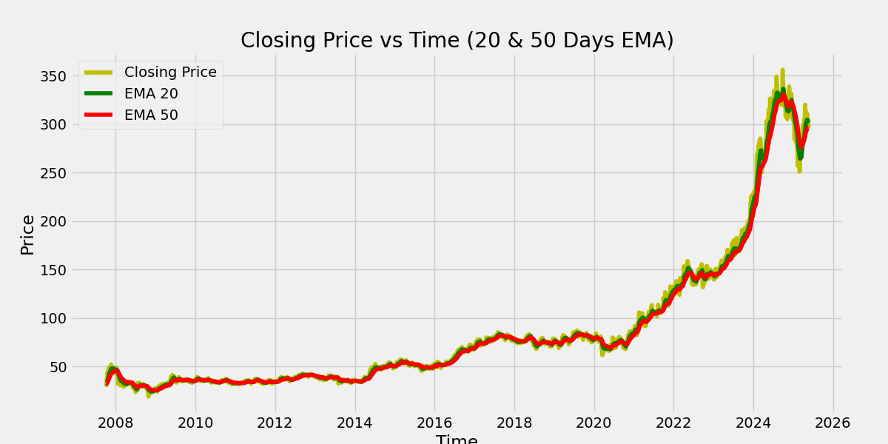

# 📈 Stock Trend Prediction App

A web app built with **Streamlit**, **TensorFlow**, and **yfinance** to visualize and predict stock trends using a deep learning model (LSTM). The app provides insights via exponential moving averages and compares original vs predicted closing prices.

🔗 **Live App:** [Streamlit Deployment](https://stock-trend-prediction-tcxuwxiww9zki2rzivrzms.streamlit.app/)

## 🚀 Features
- Predict future stock trends using a trained LSTM model.
- Visualize EMAs: 20, 50, 100, and 200-day trends.
- Compare actual vs predicted stock prices.
- Download historical stock data as a CSV file.

## 📦 Tech Stack
- Python
- Streamlit
- TensorFlow / Keras
- yfinance
- scikit-learn
- matplotlib

## 🧠 Model
The model is a deep learning LSTM network trained on historical stock price data to forecast closing prices based on the last 100 days of trends.

## 📸 Screenshots



## 📂 Setup

```bash
git clone https://github.com/yourusername/stock-trend-prediction
cd stock-trend-prediction
pip install -r requirements.txt
streamlit run app.py


